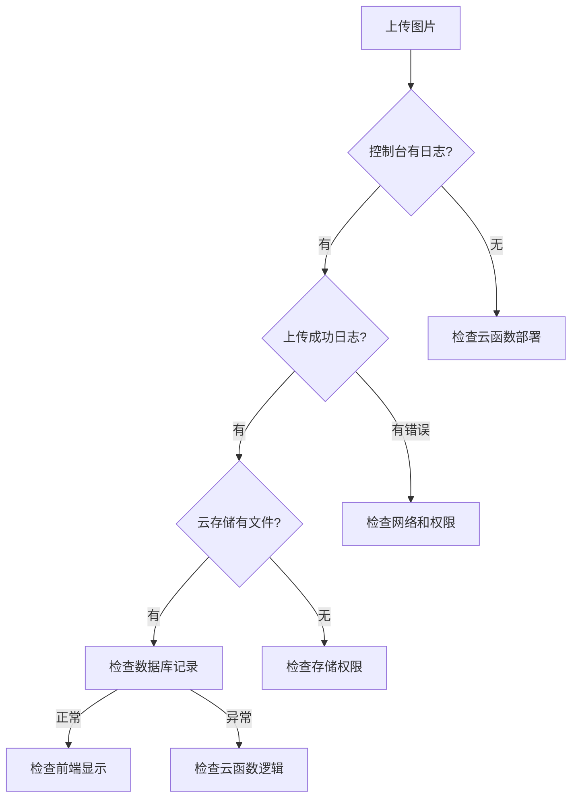

# 图片上传问题诊断报告

## 问题状态
🔍 **问题**: 图片上传后手机预览看不到，云存储中无数据
📅 **检查时间**: 2025-11-10
👨‍💻 **检查者**: AI助手

## 已完成的修复

### ✅ 1. 增强了图片上传函数
- 添加了详细的控制台日志
- 增强了错误处理机制
- 每张图片都有单独的上传状态跟踪

### ✅ 2. 修复了小程序权限配置
- 添加了相机权限 (`scope.camera`)
- 添加了相册权限 (`scope.album`)
- 添加了照片保存权限 (`scope.writePhotosAlbum`)

### ✅ 3. 创建了完整的诊断工具
- `debug-upload.js`: 上传函数诊断
- `fix-upload.js`: 自动修复脚本
- `deploy-cloud-functions.js`: 云函数部署脚本

## 问题根因分析

基于代码检查，问题可能出现在以下几个方面：

### 🎯 **主要怀疑点**
1. **云函数未正确部署** - 最可能的原因
2. **云存储权限配置错误** - 第二可能的原因
3. **云环境ID配置问题** - 第三可能的原因

### 🔍 **次要检查点**
1. 网络连接问题
2. 文件路径生成问题
3. 微信小程序版本兼容性

## 立即行动项

### 🚀 **必须执行**
1. **重新部署云函数**
   ```bash
   # 在微信开发者工具中：
   # 1. 右键 cloud/works -> 上传并部署
   # 2. 右键 cloud/upload -> 上传并部署
   # 3. 右键 cloud/system -> 上传并部署
   ```

2. **检查云开发控制台**
   - 确认环境ID: `cloud1-1gdp8tuace5811f4`
   - 确认存储服务已开通
   - 确认读写权限设置

3. **测试图片上传**
   - 打开控制台查看详细日志
   - 验证上传路径和返回的fileID

### 🔧 **建议配置**
1. **云存储权限设置**
   ```
   所有用户可读
   仅创建者可写
   ```

2. **文件夹结构**
   ```
   cloud://cloud1-1gdp8tuace5811f4.636c-cloud1-1gdp8tuace5811f4-1302599505/works/
   ```

## 测试验证步骤

### Step 1: 控制台日志验证
上传图片时应该看到：
```
开始上传图片: 1 张
工作ID: temp_1234567890
开始上传图片 0: wxfile://tmp_xxx.jpg
上传路径: works/temp_1234567890/1234567890_0_xxx.jpg
图片 0 上传成功: cloud://xxx
所有图片上传完成: ["cloud://xxx"]
```

### Step 2: 云存储验证
1. 进入云开发控制台
2. 存储管理 → 文件管理
3. 检查是否有 `works/` 文件夹
4. 确认上传的文件存在

### Step 3: 数据库验证
1. 数据库 → works集合
2. 查看最新记录的 `images` 字段
3. 确认包含正确的云存储路径

## 故障排除流程



## 联系支持信息

如果问题仍未解决，请提供：

1. **完整控制台日志**
2. **云开发控制台截图**
3. **网络环境信息**
4. **微信开发者工具版本**

## 相关文件

- `UPLOAD_TROUBLESHOOTING.md` - 详细故障排除指南
- `debug-upload.js` - 诊断脚本
- `fix-upload.js` - 自动修复脚本
- `deploy-cloud-functions.js` - 部署脚本

---
**报告生成时间**: 2025-11-10
**下次检查建议**: 部署云函数后立即测试